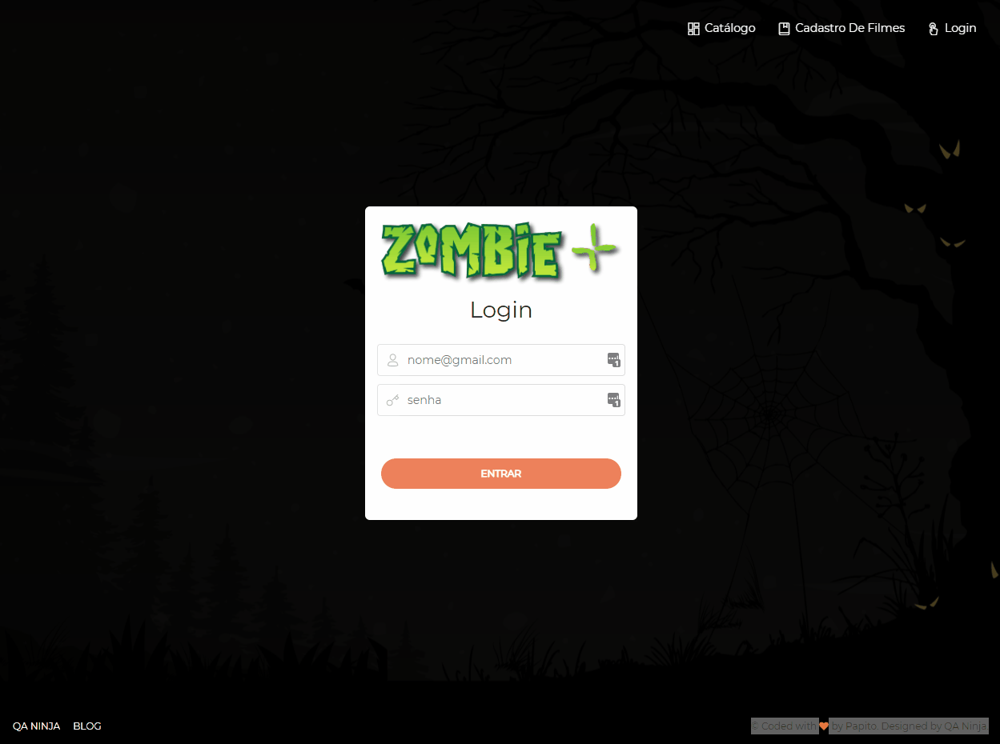

    
    <h1>Automação Node.js e Javascript</h1>
    
Curso da QA Ninja sobre Introdução ao Javascript, Automação com Nightwatch e Integração Contínua com Jenkins

    

### :memo: Modulos

#### Introdução ao Javascript 
> 1. Olá Javascript
> 2. Variáveis
> 3. Operadores
> 4. Controles de Fluxo
> 5. Loops
> 6. Arrays
> 7. Funções
> 8. Objetos
> 9. Document Object Model

#### Automação com Nightwatch.js
##### Configuração do ambiente
> 1. Instalando o Node.js
> 2. Infecção NPM
> 3. Instale o Docker
> 4. Ambiente Zombie+

##### Automação
> 1. O que é Nightwatch.js
> 2. Meu primeiro teste com Nightwatch
> 3. Múltiplos Steps
> 4. Refatorando com ES6
> 5. Fluxos Alternativos com Múltiplos Steps
> 6. Hooks
> 7. Elementos de páginas a solta. Vamos usar Page Object?
> 8. Custom Commands
> 9. Global Hooks
> 10. Encapsulando Asserts
> 11. Organizando cenários e execuções
> 12. Resident Evil - Nova Massa de Teste
> 13. Mapeando novos Elementos
> 14. Preenchendo um formulário simples
> 15. Selecionando status do filme com Xpath
> 16. Formulários complexos
> 17. Headshot na massa! SQN
> 18. Verificando se o filme é exibido na lista
> 19. Upload de Foto
> 20. Bônus: Tricks and Tips
> 21. Criando Independência no Cenário de Busca
> 22. Buscando um filme que não existe no banco de dados
> 23. Trabalhando com Grupos e Tags
> 24. Parallel Running
> 25. Executando em outros Ambientes de Testes
> 26. Firefox, Chrome e Headless

#### DevOps for Testers com Jenkins e Node.js
> 1. Jenkins com Docker
> 2. O que são Pipelines?
> 3. Trabalhando com Repositório Git
> 4. Pipeline Script from SCM
> 5. Customizando o Agente de execução com Dockerfile
> 6. Mastigando relatórios de testes
> 7. Trabalhando com diretiva post
> 8. Screenshots quando o teste falha
> 9. Devorando Screenshots
> 10. Atacando os testes de regressão

